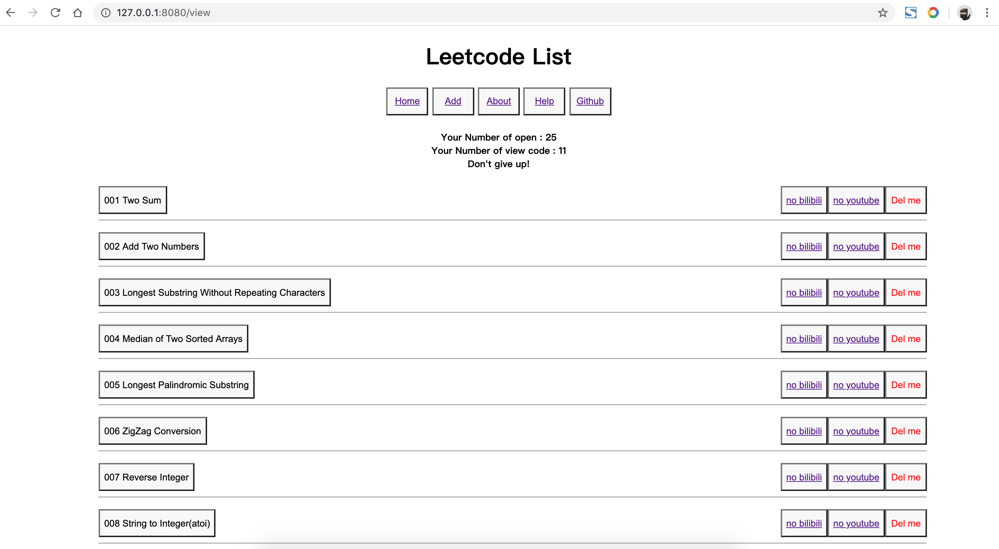
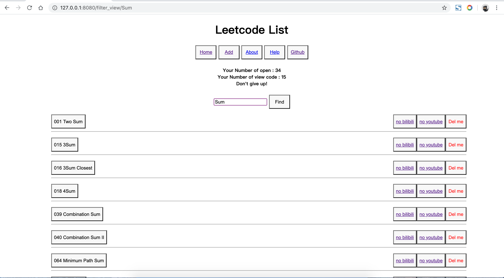
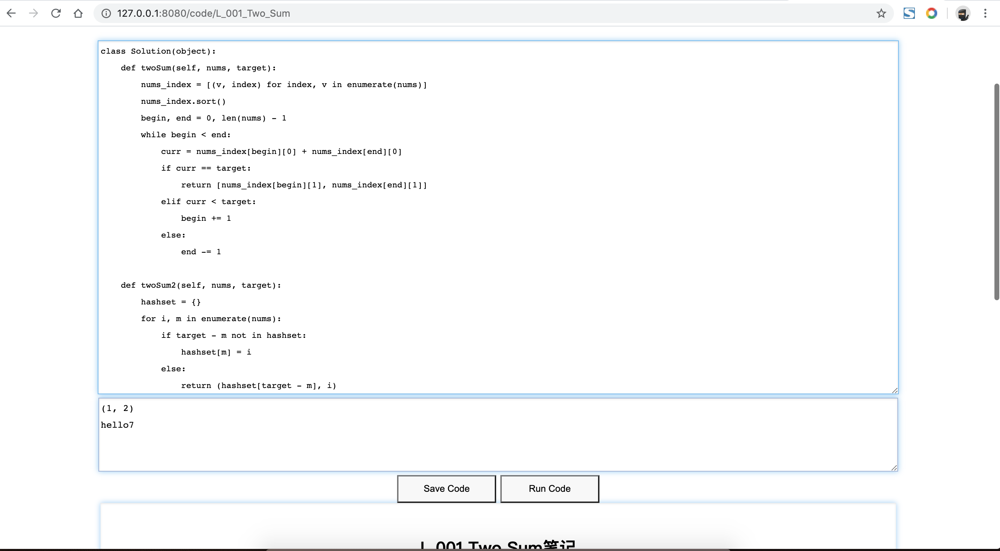
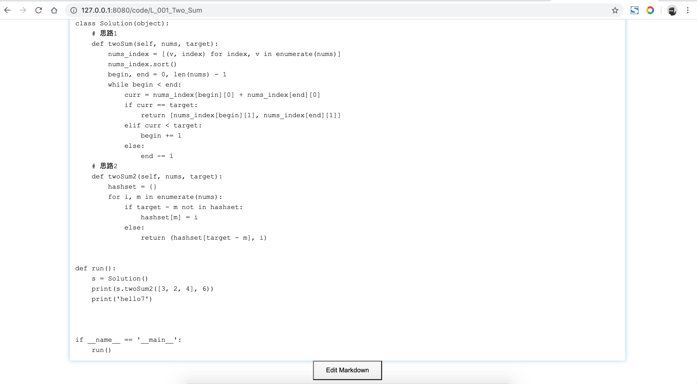
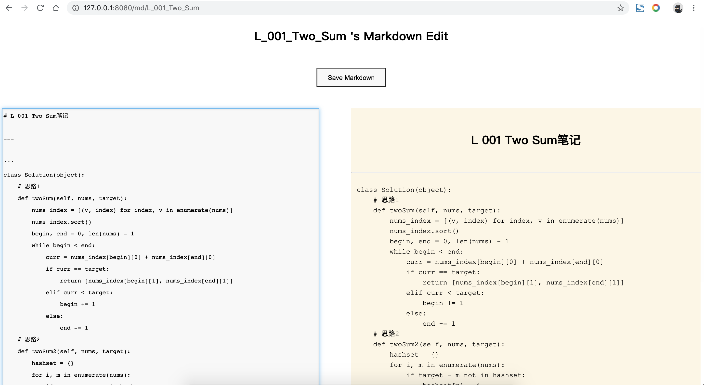

# easyleetcode

use it：`pip install easyleetcode`

then , only 2 line code , in any location:
```python
from easyleetcode import run

run()
# or run(host="127.0.0.1", port=8080, py_cmd_path='python ')
# or run(host="127.0.0.1", port=8080, py_cmd_path='python3 ')
```

note:
>If you run error in Windows platform,tell me.
>
>Because Windows platform I have't test

## Introduction

[>Video Introduction](https://www.bilibili.com/video/BV1bp4y1D7ia/)

- Hello Python 程序员//Hello Python programmer
- 你可以用它//You can use it
- 成为轻松刷Leetcode的大神//Become the God of leetcode
- 你可以用它//You can use it
- 在线运行或添加你的任意Python代码//Run or add your arbitrary Python code online
- 你可以用它//You can use it
- 给你的任意Python代码做Markdwon笔记//Take markdwon notes for any Python code you want
- 它运行非常流畅//It runs very smoothly
- 你可以把它当中代码笔记包 // You can use it as leetcode study package
## code list view
all code list , you can add new code or 

edit code or note markdown 
or see video (if exist, tell me)

or select contain keyword code use button 'Find'


## select code
only see contain 'Sum' code


## code show view
code detail view

you can run & debug & study & add code & note Markdown

you can edit you python code & run you code online !



## code markdown note view
code's markdown note 

you can click Edit Button to Edit you note


## code markdown note edit view
code's markdown note can easy online edit, and 

you can click Save Button to Save you Edited note

left textarea to edit Markdown, right textarea show markdown's result view
